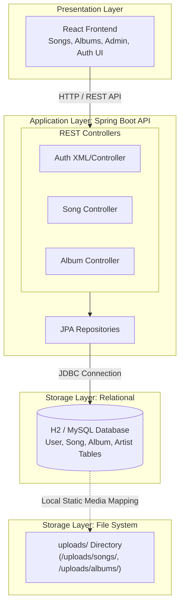
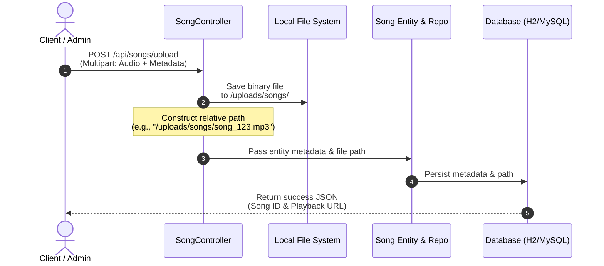
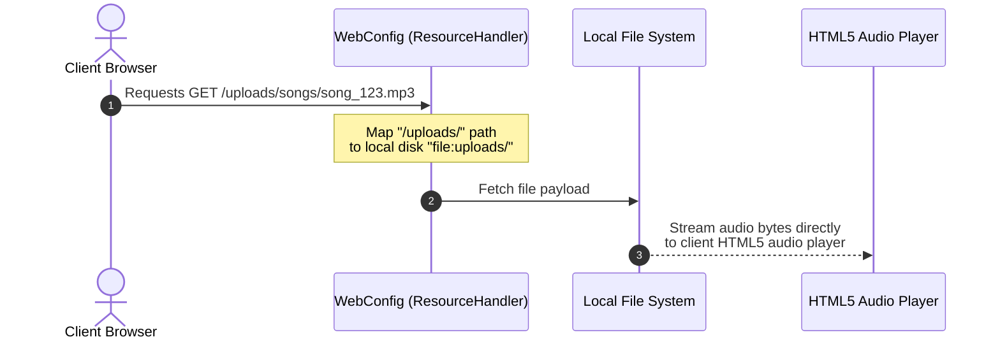
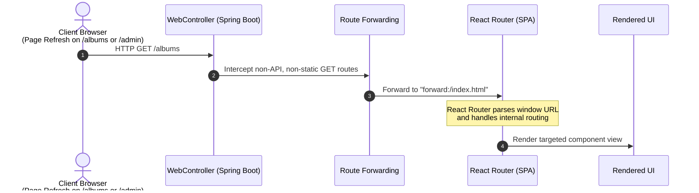
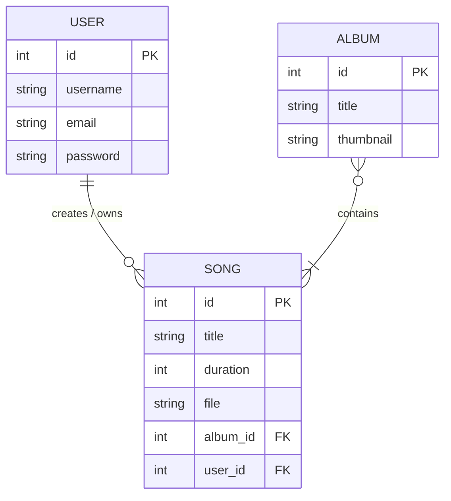

# NaadaGangaa Backend Service 

The backend service for **NaadaGangaa**—a Java 21 & Spring Boot 3 REST API providing audio streaming, static media hosting, user authentication, and album/song metadata management.

---

## System Architecture

The application follows a layered **MVC Architecture** with Spring Data JPA for persistence and Spring Web for RESTful endpoints and static asset serving.

---

## End-to-End Execution Flow

### 1. File Upload Execution Flow (MP3 / Thumbnails)

---

### 2. Audio Streaming & Media Serving Flow

---

### 3. Client Navigation Route Forwarding Flow

---

## Database Schema Relationships

---

