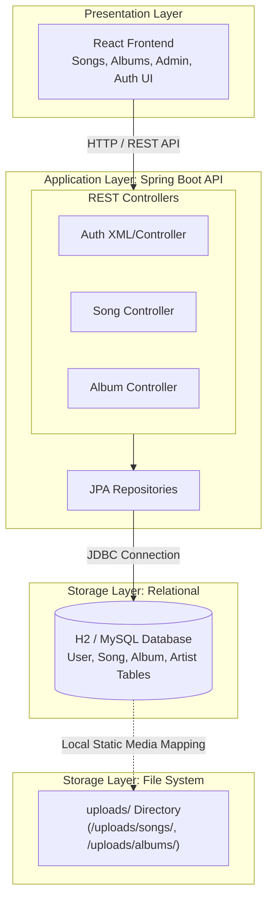

# NaadaGangaa Backend Service 

The backend service for **NaadaGangaa**—a Java 21 & Spring Boot 3 REST API providing audio streaming, static media hosting, user authentication, and album/song metadata management.

---

## System Architecture

The application follows a layered **MVC Architecture** with Spring Data JPA for persistence and Spring Web for RESTful endpoints and static asset serving.


---

## End-to-End Execution Flow

### 1. File Upload Execution Flow (MP3 / Thumbnails)
```mermaid
[ Client / Admin ]
|
| 1. POST /api/songs/upload (Multipart: Audio File + Metadata)
v
[ SongController ]
|
| 2. Save binary file to local filesystem (/uploads/songs/)
v
[ Local File System ]
|
| 3. Construct relative media path (e.g., "/uploads/songs/song_123.mp3")
v
[ Song Entity & Repository ]
|
| 4. Persist metadata & relative file path in Relational DB
v
[ Database (H2/MySQL) ]
|
| 5. Return success JSON with song ID & playback URL
v
[ Client Response ]
```

---

### 2. Audio Streaming & Media Serving Flow
```mermaid
[ Client Browser ]
|
| 1. Requests GET /uploads/songs/song_123.mp3
v
[ WebConfig (ResourceHandler) ]
|
| 2. Map "/uploads/" path to local disk "file:uploads/"
v
[ Local File System ]
|
| 3. Stream audio bytes directly to client HTML5 audio player
v
[ HTML5 Audio Player ]
```

---

### 3. Client Navigation Route Forwarding Flow
```mermaid
[ Client Browser (Page Refresh on /albums or /admin) ]
|
| 1. HTTP GET /albums
v
[ WebController ]
|
| 2. Intercept non-API, non-static GET routes
v
[ Route Forwarding ]
|
| 3. Forward to "forward:/index.html"
v
[ React Router (SPA) ]
|
| 4. React Router parses window URL and renders target page
v
[ Rendered UI ]
```

---

## 🗄 Database Schema Relationships
```mermaid
+--------------------+        1 : N        +--------------------+
| User | ------------------< | Song |
| ---- ||--------------------|
| id (PK)            |                     | id (PK)            |
| username           |                     | title              |
| email              |                     | duration           |
| password           |                     | file               |
+--------------------+                     | album_id (FK)      |
+--------------------+
|
+--------------------+                               |
| Album     | ------------------------------+ (Optional N:1) |
| --------- |
| id (PK)   |
| title     |
| thumbnail |
+--------------------+
```

---

